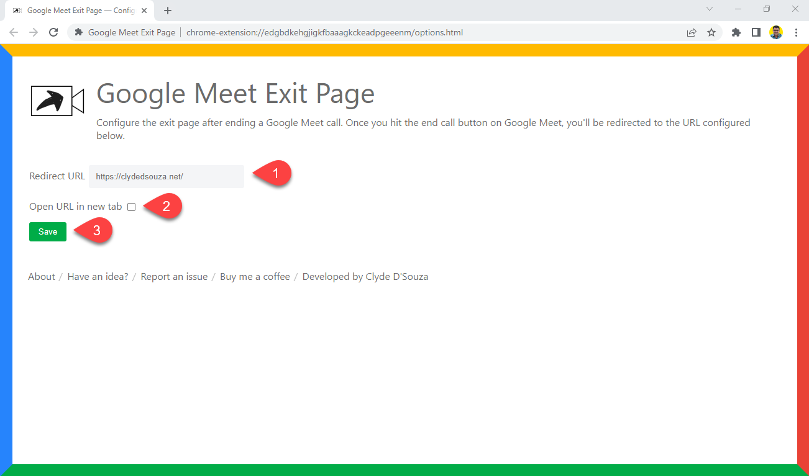

# Google Meet Exit Page
Configure the exit page after ending a Google Meet call.

## Why?
Configure the exit page that should be visible after a user ends a Google Meet call. A user will have to click the 'Leave call' button from Google Meet to then be redirected to the other page. This is useful if you always need to  visit the same page after every meeting, or have a similar requirement. 

The exit page can be configurable from the extensions' Options page. You can also configure if the exit page needs to open in a new tab or the same tab. 

## Instructions
Install the extension from the [Chrome Web Store](https://bit.ly/gmep-ext). 

After installing this extension, you'll be automatically redirected to the Options page. 

From the options page:
1. Configure the URL of the website you want to be redirected to once you end a Google Meet call. 
1. If you want this website to open in a new tab, check this box. By default, the configured website will open in the same tab. 
1. Don't forget to click the Save button after making any changes. 

Now, if you join a Google Meet call and then click on the 'Leave call' button to end the meeting, you should be redirected to the configured website. 

## Credits
Developed by [Clyde D'Souza](https://clydedsouza.net/)